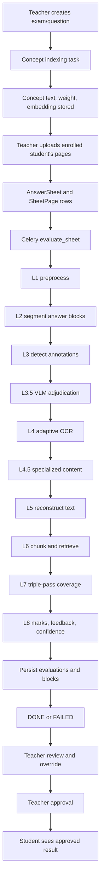

# Answer-Sheet Evaluation Workflow

This document explains what the current system does after a teacher uploads a student answer sheet. It follows the code as it exists today, not only the planned architecture.

The system has two phases:

1. Preparation: the teacher creates questions and saves model answers. Concepts are extracted and embedded asynchronously.
2. Evaluation: the teacher uploads one student's pages. Celery processes the images, reconstructs the answer, compares it with stored concepts, calculates marks and confidence, and waits for teacher approval before the student can see the result.

### Current extraction mode

Production now defaults to **VLM-first extraction**. The VLM receives each
complete page and returns structured question blocks containing question number,
page-pixel bounding box, answer text, content type, annotations, and confidence.
The older OpenCV/Tesseract pipeline remains available behind
`VLM_FIRST_EXTRACTION=false` for regression comparison and fallback work; it is
disabled in the normal production path. The VLM-first implementation is in
[ai/ocr/vlm_extractor.py](../ai/ocr/vlm_extractor.py), and the switch is in
`config/settings/base.py`.

Main implementation surfaces:

- Upload/API orchestration: [apps/evaluation/views.py](../apps/evaluation/views.py)
- Celery task: [apps/evaluation/tasks.py](../apps/evaluation/tasks.py)
- Image-to-evaluation glue: [apps/evaluation/pipeline_runner.py](../apps/evaluation/pipeline_runner.py)
- Pure AI pipeline: [ai/](../ai/)
- Database objects: [apps/evaluation/models.py](../apps/evaluation/models.py)

## 1. High-level flow



The backend advertises thirteen progress stages:

```text
queued
preprocessing
segmentation
annotations
adjudication
ocr
specialized
reconstruction
retrieval
coverage
scoring
feedback
done
```

These values are defined in `AnswerSheet.Stage` in [apps/evaluation/models.py](../apps/evaluation/models.py). The task updates the stage before running associated work, but the real image work is grouped in `create_real_evaluations()` at the scoring-stage boundary. The stage labels are progress markers for the UI, not separate Celery tasks.

## 2. Preparation: indexing the model answer

Before a student sheet can be graded meaningfully, each question needs stored concepts. The teacher creates a question through:

```text
POST /api/exams/{exam_id}/questions/
```

`QuestionListCreateView.perform_create()` in [apps/exams/views.py](../apps/exams/views.py) stores a SHA-256 hash of the model answer and queues `index_question_concepts`:

```python
question = serializer.save(
    exam=exam,
    model_answer_hash=Question.hash_answer(
        serializer.validated_data["model_answer"]
    ),
)
index_question_concepts.delay(question.id)
```

### 2.1 Concept extraction

The task in [apps/exams/tasks.py](../apps/exams/tasks.py) does the following:

1. Loads the question and model answer.
2. Selects an LLM provider through `get_llm_provider()`.
3. Asks the LLM to extract independently gradable concepts.
4. Selects an embedding provider.
5. Embeds every extracted concept.
6. Deletes old concept rows.
7. Inserts new concept text, weight, order, and vector.
8. Sets `concepts_indexed_at`.

The stored object is `Concept` in [apps/exams/models.py](../apps/exams/models.py):

```text
Concept(question, text, weight, order, embedding)
```

The frontend polls:

```text
GET /api/questions/{question_id}/concepts/
```

until concepts are available. An empty response means indexing has not finished, or that the indexing task failed.

### 2.2 Provider selection

[ai/providers/factory.py](../ai/providers/factory.py) selects providers using `LLM_PROVIDER`:

```python
if name == "mock":
    return MockLLMProvider()
if name == "nim":
    return NIMLLMProvider()
if name == "ollama":
    return OllamaLLMProvider()
```

Test settings force `mock`, so automated tests do not contact a model provider. During the live test on 2026-09-23, the configured NIM model `nvidia/nemotron-3-nano-30b-a3b` returned HTTP 410 because NVIDIA retired it. Model-answer indexing can therefore fail before a sheet is uploaded.

## 3. Upload request

The teacher uploads pages to:

```text
POST /api/exams/{exam_id}/sheets/
Content-Type: multipart/form-data
```

The route is in [apps/evaluation/urls.py](../apps/evaluation/urls.py), and both `GET` and `POST` for this collection are handled by `ExamSheetsView` in [apps/evaluation/views.py](../apps/evaluation/views.py).

Expected multipart fields:

```text
student = enrolled student id
pages[] = one or more JPG, PNG, or PDF files
```

`SheetUploadSerializer` in [apps/evaluation/serializers_upload.py](../apps/evaluation/serializers_upload.py) checks:

```python
if f.content_type not in settings.ALLOWED_UPLOAD_CONTENT_TYPES:
    raise serializers.ValidationError(...)
if f.size > settings.MAX_UPLOAD_SIZE_BYTES:
    raise serializers.ValidationError(...)
```

Current allowed declared MIME types are:

```text
image/jpeg
image/png
application/pdf
```

The upload boundary checks the declared MIME type and per-file size. It does not decode the image or enforce an aggregate page/size limit at this point. Decode validation happens later in the worker.

### 3.1 Authorization and enrollment

`ExamSheetsView` requires an authenticated teacher. It scopes the exam to that teacher:

```python
exam = _get_owned_exam(request, exam_id)
```

`_get_owned_exam()` only finds an exam where `teacher=request.user`. A different teacher receives a 404.

The selected student must be enrolled in that exam:

```python
if not Enrollment.objects.filter(exam=exam, student=student).exists():
    return Response(
        {"student": ["This student is not enrolled in this exam."]},
        status=400,
    )
```

### 3.2 Database rows created by upload

After validation, the API creates one `AnswerSheet` row and one `SheetPage` row per uploaded file:

```python
sheet = AnswerSheet.objects.create(
    exam=exam,
    student=student,
    page_count=len(pages),
)
for i, page in enumerate(pages):
    sheet.pages.create(index=i, image=page)
```

The page filename is rewritten to a UUID path by `sheet_page_path()` in [apps/evaluation/models.py](../apps/evaluation/models.py):

```text
media/sheets/{exam_id}/{sheet_id}/{uuid}.{extension}
```

The initial state is:

```text
status = QUEUED
stage = queued
confidence = 0.0
band = RED
evaluations = []
```

The API queues the Celery task and responds with HTTP `202`:

```python
evaluate_sheet.delay(sheet.id)
return Response(SheetSerializer(sheet).data, status=202)
```

With a real worker, the response returns before evaluation finishes. In tests, Celery is configured eager, so the task may already be complete when the test examines the database.

## 4. Celery task and progress state

The worker executes `evaluate_sheet(sheet_id)` in [apps/evaluation/tasks.py](../apps/evaluation/tasks.py).

The task has an outer failure boundary:

```python
@shared_task
def evaluate_sheet(sheet_id: int):
    try:
        _run(sheet_id)
    except Exception as exc:
        AnswerSheet.objects.filter(id=sheet_id).update(
            status=AnswerSheet.Status.FAILED,
            error_message=f"Evaluation failed: {exc}",
        )
        raise
```

Normal Python exceptions are recorded as `FAILED`, then re-raised so Celery also records a failed task. A hard worker crash, process kill, or OOM can occur outside this `except` block and may leave a sheet in `RUNNING`; the code documents that limitation.

Inside `_run()`:

1. Load the sheet and exam.
2. Set `status=RUNNING` and `stage=queued`.
3. Construct embedding, LLM, and VLM providers.
4. Load exam questions with their concepts.
5. Walk the stage list.
6. At `scoring`, call `create_real_evaluations()`.
7. Average evaluation confidence.
8. Set `status=DONE`, final confidence, final band, and clear the error.

The frontend polls:

```text
GET /api/sheets/{sheet_id}/status/
```

It stops polling when status is `DONE`, `FAILED`, or `APPROVED`.

## 5. Image decoding and page handling

The detailed image pipeline begins in [apps/evaluation/pipeline_runner.py](../apps/evaluation/pipeline_runner.py).

`_decode_pages()` reads each stored file:

```python
with sheet_page.image.open("rb") as fh:
    raw = fh.read()
```

For PDFs, PyMuPDF renders every PDF page at 200 DPI into a BGR NumPy image. For ordinary images, OpenCV decodes the raw bytes:

```python
arr = cv2.imdecode(
    np.frombuffer(raw, dtype=np.uint8),
    cv2.IMREAD_COLOR,
)
if arr is None:
    raise ValueError("Could not decode uploaded page image")
```

This is why a file can pass upload validation and still fail later. The existing browser E2E helper uploads a 1x1 PNG. The API accepts it, but the real worker rejects it while decoding. That helper is therefore still a fixture for the old stub behavior, not a valid real-pipeline answer-sheet test.

## 6. L1: legacy preprocessing path

When `VLM_FIRST_EXTRACTION=true`, this legacy path is skipped for answer
extraction. It remains documented because it is still available for regression
tests and can be used as a fallback while comparing provider quality.

The page image is sent to `preprocess()` in [ai/preprocessing.py](../ai/preprocessing.py).

The sequence is:

```text
input image
  -> grayscale
  -> non-local means denoising
  -> CLAHE contrast normalization
  -> skew estimation
  -> deskew rotation
  -> adaptive threshold
  -> quality score
```

The output is a `PreprocessResult`:

```python
PreprocessResult(
    image=deskewed_grayscale,
    binary=thresholded_image,
    skew_angle=angle,
    quality_score=quality,
)
```

The binary convention is `ink=255` and `background=0`. The quality score combines sharpness and contrast in `[0, 1]`:

```python
return round(
    0.6 * sharpness_score + 0.4 * contrast_score,
    4,
)
```

That quality score later contributes 35% of confidence and helps choose the OCR path.

## 7. L2: segmentation into answer blocks

Each preprocessed page is passed to `segment_page()` in [ai/segmentation.py](../ai/segmentation.py).

Segmentation uses the horizontal projection profile of the binary page:

```python
profile = projection_profile(binary)
```

The algorithm:

1. Counts ink pixels for every row.
2. Finds contiguous ink runs.
3. Removes very small noise runs.
4. Measures gaps between runs.
5. Uses Otsu's method or an adaptive line-pitch fallback to find unusually large gaps.
6. Treats those gaps as answer-block boundaries.

Each result is a `Segment`:

```python
Segment(
    bbox=BBox(x=0, y=top, w=page_width, h=block_height),
    question_number="1a" or None,
    is_continuation=True or False,
)
```

### 7.1 Question-number recognition

For each block, the system tries to read the question number from a small top-left strip using Tesseract with a restricted character whitelist. It accepts labels such as `1)`, `Q1a)`, or `2.`.

If Tesseract fails and a VLM is available, the entire block is sent to the VLM with a prompt asking for only the question number or `NONE`.

The previous question number is carried across pages, so an unlabeled continuation block can be attached to the previous answer. The runner normalizes identifiers by lowercasing and removing non-alphanumeric characters:

```python
def _normalise_number(value: str) -> str:
    return re.sub(r"[^0-9a-z]", "", (value or "").lower())
```

For a single-question exam, all segmented blocks are assigned to that one question because there is no competing question to confuse them. For a multi-question exam, the normalized detected number must match a stored question number.

## 8. L3: annotation detection

For every segmented block, `_process_block()` calls `adjudicate()` from [ai/annotations/adjudicator.py](../ai/annotations/adjudicator.py).

The detector chain runs:

```python
all_candidates = (
    strikethrough.detect(binary)
    + underline.detect(binary)
    + arrows.detect(binary)
    + margins.detect(binary)
)
```

The four annotation kinds are:

| Kind | Meaning | Default intent |
|---|---|---|
| `STRIKE` | Text crossed out | `CORRECTION` |
| `UNDERLINE` | Text emphasized | `EMPHASIS` |
| `ARROW` | Pointer to an insertion or related content | `INSERTION` |
| `MARGIN` | Note outside the main answer column | `INSERTION` |

Each annotation includes `kind`, `intent`, `bbox`, `confidence`, and `resolved_by` (`CV` or `VLM`). Overlapping candidates are deduplicated by intersection-over-union, keeping the higher-confidence candidate.

## 9. L3.5: VLM annotation adjudication

If an annotation candidate has confidence below `ANNOTATION_AMBIGUITY_THRESHOLD` (`0.70`), the block crop is sent to the VLM.

The VLM distinguishes a student mark from a printed line, table border, divider, or ruled-paper line. It must return one of:

```text
STRIKE
UNDERLINE
ARROW
MARGIN
NONE
```

If it returns `NONE`, the candidate is discarded. Otherwise the candidate kind, intent, confidence, and `resolved_by` are replaced:

```python
return replace(
    candidate,
    kind=kind,
    intent=_DEFAULT_INTENT.get(kind, candidate.intent),
    confidence=1.0,
    resolved_by="VLM",
)
```

The `resolved_by` value is later visible in the review overlay. VLM-resolved boxes are rendered with dashed borders by the frontend.

## 10. L4: adaptive OCR

After annotation detection, the runner masks strike regions before OCR. This prevents OCR/VLM from relying only on a prompt instruction to ignore crossed-out text:

```python
ocr_input = _mask_struck_regions(block_gray, annotations)
ocr_result = run_ocr(ocr_input, vlm)
```

`run()` in [ai/ocr/router.py](../ai/ocr/router.py) chooses the first OCR route:

```python
result = (
    run_psm6(gray)
    if is_high_quality(gray)
    else run_psm11_with_morphology(gray)
)
```

It then checks Tesseract confidence. If confidence is below `OCR_CONFIDENCE_ESCALATION_THRESHOLD` (`0.65`), it sends the crop to the VLM:

```python
if result.confidence < OCR_CONFIDENCE_ESCALATION_THRESHOLD:
    return vlm_engine.transcribe(gray, vlm)
```

The intended routes are:

| Condition | First operation | Possible escalation |
|---|---|---|
| Good quality | Tesseract PSM 6 | VLM if OCR confidence is low |
| Lower quality | Morphology + Tesseract PSM 11 | VLM if OCR confidence is low |

If the VLM transcribes the block, that transcription becomes reconstructed text directly. If Tesseract succeeds, the runner extracts word-level boxes and sends them to reconstruction.

## 11. L4.5: diagrams, tables, and equations

Before ordinary OCR, `content_type.classify()` in [ai/ocr/content_type.py](../ai/ocr/content_type.py) decides whether the block looks like:

```text
TEXT | DIAGRAM | TABLE | EQUATION
```

The classifier uses connected components, structural-line detection, text density, regular text-line spacing, and grid-line detection.

If the type is not `TEXT`, ordinary Tesseract OCR is skipped. [ai/ocr/specialized.py](../ai/ocr/specialized.py) calls the VLM with a type-specific instruction:

- diagram: describe shapes, labels, and connections
- table: transcribe rows and columns
- equation: transcribe using plain-text math notation

The returned description or transcription is stored as `AnswerBlock.reconstructed_text`, so downstream retrieval sees it like ordinary answer text. This is the intended path for answers expressed as drawings instead of prose, but it remains a best-effort classifier and depends on a working VLM provider.

## 12. L5: reconstruction

For a Tesseract result, `reconstruct()` in [ai/reconstruct.py](../ai/reconstruct.py) receives OCR words and annotations.

It performs these operations:

1. Sorts words top-to-bottom and left-to-right.
2. Removes words overlapping `STRIKE` annotations.
3. Removes margin-note words from body text.
4. OCRs margin notes separately.
5. Matches margin notes to nearby arrows using a KD-tree.
6. Inserts margin text near the nearest body word.

The filtering rule is:

```python
return [
    w for w in words
    if not any(_overlaps(w.bbox, region, y_pad=STRIKE_OVERLAP_Y_PAD)
               for region in strikes)
    and not any(_overlaps(w.bbox, region) for region in margins)
]
```

The final string may contain margin insertions in brackets:

```text
body sentence [margin note] next sentence
```

The runner concatenates reconstructed text from all blocks assigned to one question:

```python
combined_text = " ".join(
    p["reconstructed_text"] for p in processed_blocks
).strip()
```

## 13. L6: chunking and retrieval

The pure AI evaluator is called once per stored question:

```python
result = evaluate_question(
    reconstructed_text=combined_text,
    concepts=concepts,
    max_marks=question.max_marks,
    ocr_quality=avg_quality,
    llm=llm,
    embedder=embedder,
)
```

`chunk_text()` in [ai/rag/chunker.py](../ai/rag/chunker.py):

1. Splits at sentence punctuation.
2. Splits long sentences at commas.
3. Tracks character offsets.
4. Marks chunks overlapping underlined spans.

Each chunk becomes:

```python
Chunk(
    text="...",
    start=character_start,
    end=character_end,
    underlined=False,
)
```

The chunks are embedded in one batch:

```python
chunk_vectors = list(zip(
    chunks,
    embedder.embed([c.text for c in chunks]),
    strict=True,
))
```

For each model-answer concept, the current code calls `retrieve()` in [ai/rag/retriever.py](../ai/rag/retriever.py), which uses in-memory cosine similarity and returns the top three chunks. The current implementation does not persist student chunks and does not execute a live Postgres `<=>` ANN query, despite that being the architecture described in the planning documents.

The top chunks are joined into the evidence excerpt sent to the coverage LLM:

```python
retrieved_text = " ".join(
    chunk.text for chunk, _similarity in ranked
)
```

Similarity is remapped from raw cosine `[-1, 1]` to `[0, 1]`:

```python
similarity = round((raw_similarity + 1) / 2, 4)
```

## 14. L7: triple-pass coverage judgment

For each concept, `check_coverage()` in [ai/coverage.py](../ai/coverage.py) builds a prompt containing only:

```text
<concept>...</concept>
<excerpt>...</excerpt>
```

It asks the LLM for:

```json
{"verdict": "COVERED" | "PARTIAL" | "MISSING"}
```

The default pass count is three. The passes run concurrently:

```python
with ThreadPoolExecutor(max_workers=pass_count) as pool:
    votes = list(
        pool.map(
            lambda _: _single_pass(concept_text, retrieved_text, llm),
            range(pass_count),
        )
    )
```

The majority verdict becomes the concept coverage result. Agreement is the number of votes matching the majority divided by total votes. Each vote is intended to be persisted to `EvaluationRun` with its raw JSON response and pass number.

## 15. L8: concept marks

`band_concept()` in [ai/scoring.py](../ai/scoring.py) combines similarity and the LLM verdict.

| Similarity / LLM result | Status | Factor |
|---|---|---:|
| Similarity >= 0.72 and LLM `COVERED` | `COVERED` | 1.0 |
| LLM `PARTIAL` | `PARTIAL` | 0.5 |
| LLM `COVERED` but similarity < 0.72 | `PARTIAL` | 0.5 |
| LLM `MISSING` but similarity >= 0.50 | `PARTIAL` | 0.5 |
| LLM `MISSING` and similarity < 0.50 | `MISSING` | 0.0 |

For concept weight `w` and question maximum `M`:

```python
concept_max = Decimal(str(weight)) * max_marks
marks = concept_max * factor
```

Marks are rounded to two decimal places. The question automatic mark is the sum of all concept marks:

```python
auto_marks = sum((c.marks for c in concept_results), Decimal("0"))
```

The current production runner does not pass underline character spans into `evaluate_question()`, so the documented underline similarity boost is not reliably activated by real uploads.

## 16. Feedback generation

After concept results are calculated, `evaluate_question()` calls `generate_feedback()` in [ai/feedback.py](../ai/feedback.py).

The response has three fields:

```text
strengths
gaps
suggestions
```

These are stored on `Evaluation` as:

```text
feedback_strengths
feedback_gaps
feedback_suggestions
```

Feedback is another LLM call. A provider failure can therefore fail the complete sheet even when OCR, retrieval, and scoring already completed.

## 17. Confidence and band

Confidence is calculated in [ai/confidence.py](../ai/confidence.py):

```text
confidence =
    0.35 * OCR quality
  + 0.40 * triple-pass agreement
  + 0.25 * retrieval agreement
```

Retrieval agreement measures how often the LLM verdict matches the independent similarity-only band.

The bands are:

```text
GREEN  >= 0.80
ORANGE >= 0.65 and < 0.80
RED    < 0.65
```

An evaluation stores its own confidence and band. Sheet confidence is the arithmetic mean of all question evaluation confidences:

```python
avg_confidence = sum(
    e.confidence for e in evaluations
) / len(evaluations)
```

The sheet receives its final band from that average.

## 18. Persistence of results

For each exam question, the runner creates one `Evaluation` row containing:

```text
question snapshot
max_marks snapshot
auto_marks
confidence
band
three feedback fields
```

For each concept result, it creates one `ConceptScore` row:

```text
concept_text
status
similarity
marks
max_marks
evidence
disagreed
```

For each coverage pass, it creates one `EvaluationRun` row containing the raw provider response.

For each processed image block, `_save_block()` stores:

```text
crop image
image width and height
quality score
content type
OCR engine
raw OCR text
reconstructed text
```

It then bulk-creates `Annotation` rows with crop-local pixel coordinates:

```json
{"x": 210, "y": 88, "w": 96, "h": 14}
```

These coordinates are intended for the frontend SVG `viewBox` overlay.

## 19. Completion and failure

If all work succeeds:

```text
AnswerSheet.status = DONE
AnswerSheet.stage = done
AnswerSheet.confidence = average evaluation confidence
AnswerSheet.band = GREEN, ORANGE, or RED
AnswerSheet.error_message = ""
```

If a normal exception occurs:

```text
AnswerSheet.status = FAILED
AnswerSheet.error_message = "Evaluation failed: ..."
```

The frontend shows the failure and provides a retry action. The current retry endpoint resets the sheet to `QUEUED` and queues the task again.

Observed during live testing on 2026-09-23:

- A 1x1 PNG passed upload validation but failed during worker decode.
- A valid repository JPEG reached evaluation but failed because the configured NIM LLM model returned HTTP 410 after retirement.
- In both cases the sheet correctly received `FAILED` with an error message.
- A worker process crash is not handled by the task's Python `except` block and can leave `RUNNING` state behind.

## 20. Teacher review and override

The teacher reads the queue at:

```text
GET /api/exams/{exam_id}/sheets/?band=red&status=DONE
```

The sheet detail endpoint returns nested evaluations, blocks, annotations, concept scores, feedback, evidence, and image URLs:

```text
GET /api/sheets/{sheet_id}/
```

The teacher can override one question's marks through:

```text
PATCH /api/evaluations/{evaluation_id}/
```

The override is checked against the evaluation maximum and stored separately from `auto_marks`:

```python
evaluation.override_marks = validated_data["override_marks"]
evaluation.save(update_fields=["override_marks", "override_comment"])
```

The effective mark is:

```python
return (
    self.override_marks
    if self.override_marks is not None
    else self.auto_marks
)
```

Sheet totals are recomputed from effective marks at serialization time, so an override changes the displayed total without changing the machine's original mark.

## 21. Approval and student release

The teacher approves through:

```text
POST /api/sheets/{sheet_id}/approve/
```

Approval is accepted only for `DONE` or an already `APPROVED` sheet. On approval:

```text
status = APPROVED
approved_at = current time
```

The student result list is:

```text
GET /api/results/
```

The backend filters both ownership and approval:

```python
AnswerSheet.objects.filter(
    student=student,
    status=AnswerSheet.Status.APPROVED,
)
```

The student detail endpoint applies the same restrictions and strips teacher-only data. In `for_student` serializer context it removes evidence quotes, raw crop URLs, and raw OCR text.

The student can see marks, concept status, feedback, confidence, and safe annotation summaries, but not another student's result or unapproved data.

## 22. What the tests prove

The current automated tests prove these areas offline:

- API status codes and serializers
- teacher/student permission boundaries
- upload enrollment checks
- UUID storage paths
- synthetic preprocessing and segmentation
- synthetic strike-through, underline, arrow, and margin detection
- OCR routing decisions
- reconstruction behavior
- mock embedding and retrieval behavior
- triple-pass voting with mock providers
- scoring thresholds and confidence bands
- override and approval behavior
- frontend route guards and overlay scaling

The backend suite passed 271 tests, and the frontend suite passed 63 tests. Frontend typecheck and production build also passed.

## 23. What is not yet demonstrated

The repository does not yet prove real-world accuracy against a labeled set of handwritten answer sheets. There is no measured result for:

- handwriting character or word accuracy
- strike-through intent accuracy on real handwriting
- underline detection accuracy on real handwriting
- margin-arrow attachment accuracy
- diagram/table/equation description accuracy
- concept retrieval quality with a current real embedding provider
- agreement with teacher-awarded marks
- Pearson correlation against teacher grades
- the stated `< 30 s` real-provider latency target

Most committed fixtures are printed or synthetic. The real provider path is currently blocked by the retired NIM model configured in the environment.

The technically accurate current status is:

> The system has an implemented and tested offline pipeline architecture, but real handwritten-sheet grading accuracy and live provider reliability remain unvalidated until a current provider and teacher-labeled benchmark sheets are available.
